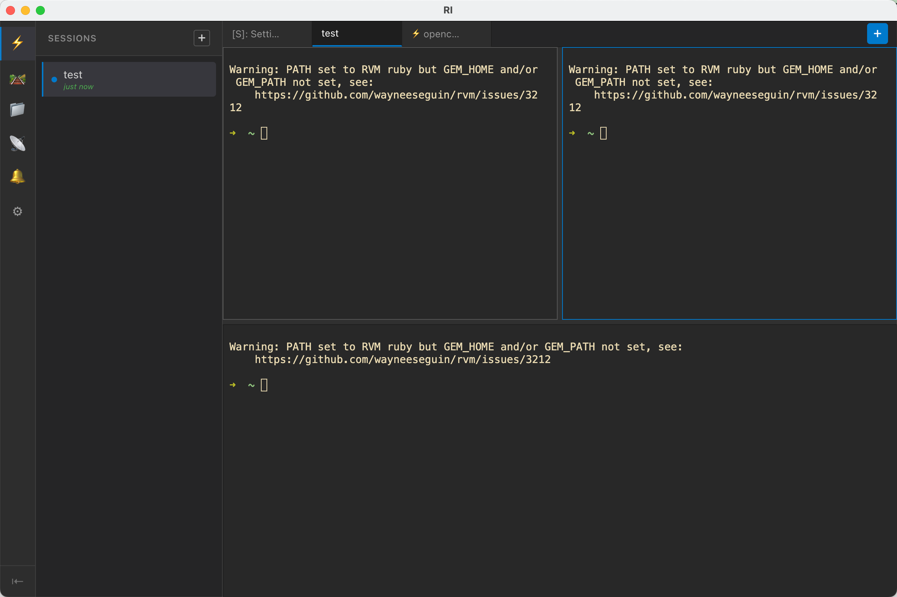
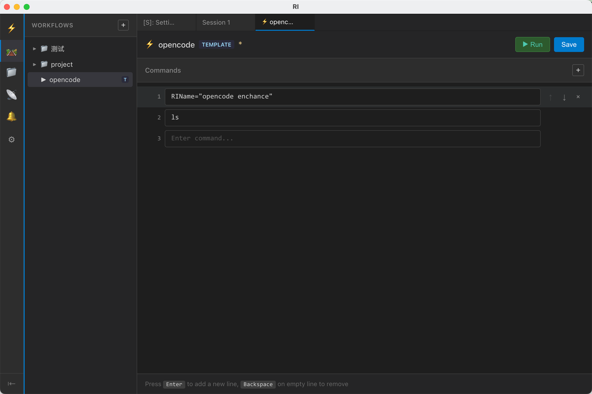
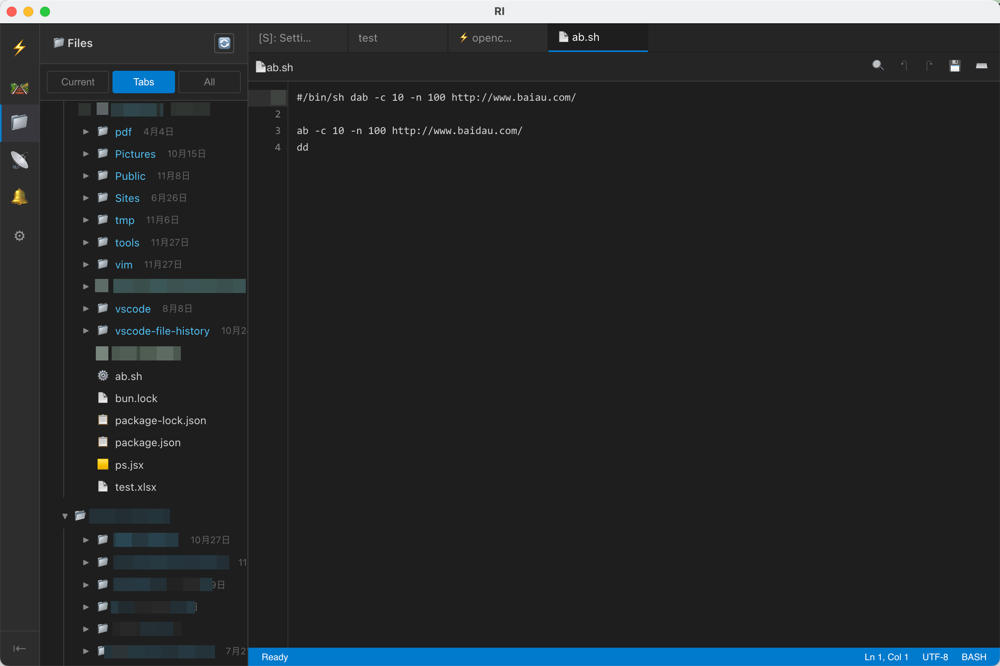

# RI

> [English](#) | [中文文档](./README_CN.md)

A modern terminal session manager built with Electron, React, and TypeScript. Organize your development workflows with multiple terminal sessions, command history tracking, workflow automation, and an intuitive unified interface.



## Features

### Core Features
- **Multiple Terminal Sessions**: Create and manage multiple terminal sessions with independent processes
- **Unified Tab System**: All content (terminals, history, flows, settings) displayed in a single tab bar
  - Terminal tabs: Session name (e.g., "Session 1")
  - Flow tabs: `⚡ Flow Name` prefix
  - History tabs: `[H]: Session name` prefix
  - Settings tabs: `[S]: Settings` prefix
- **Robust Process Management**: Automatically cleans up all child processes when a session is closed
- **Session Persistence**: Sessions remain alive even when tabs are closed
- **Drag-and-Drop Tabs**: Reorder tabs by dragging them to your preferred position

### Navigation & Views
- **Icon Sidebar**: Quick access to different views
  - ⚡ Sessions - Manage terminal sessions
  - 📁 Files - Browse workspace files
  - 📜 History - View command history per session
  - 🔔 Notify - Monitor terminal notifications
  - 🔧 Flow - Workflow automation
  - ⚙ Settings - Application configuration
- **Collapsible Navigation Panel**: Context-aware left panel for session/history/flow lists
- **Master-Detail Layout**: List navigation on left, detailed content on right

 

### Terminal Features
- **Full xterm.js terminal emulation** with auto-fit sizing
- **Split Terminal Support**: Horizontal and vertical splits within a session
- **Command history preservation** with session log tracking
- **Color output support** and proper ANSI sequence handling
- **Auto-naming**: First command automatically names the session
- **AI Tool Detection**: Monitor AI assistant usage (OpenCode, Copilot, Aider, Cursor, Cline)
- **Safe Deletion**: Context-menu style confirmation for deleting sessions
- **IME Support**: Proper handling of input method editors (Chinese, Japanese, etc.)
- **Smart Backspace**: Backspace respects IME composition state
- **Click-to-Activate**: Click anywhere on split terminal (including text content) to activate it


### Workflow Automation (Flow)

Automate your development workflows with the Flow feature:

- **Tree Structure**: Organize workflows in folders and subfolders
- **Visual Editor**: Edit workflow commands with line numbers
- **Auto-Add Lines**: New line automatically added when typing in the last row
- **One-Click Run**: Execute all workflow commands in a new session
- **Right-Click Menu**: Quick actions for create, rename, and delete
- **Collapsible Folders**: Keep your workflow list organized



**Flow Features:**
- 📁 **Folder Organization**: Group related workflows together
- ⚡ **Quick Execution**: Double-click to run a workflow
- ✏️ **Inline Rename**: Edit names directly in the tree
- 🔄 **Command Editor**: Full-featured command sequence editor with auto-add
- 💾 **Auto-Save**: Changes persist automatically

 

### History & Logging
- **Session Logs**: Automatic command history recording per session
- **Statistics**: Track record count, file size, and last activity time
- **History Viewer**: Browse past commands with timestamps
- **Log Management**: Clear individual session history when needed

### File Manager

Workspace file browser with powerful features:

- **Multi-Mode View**: Switch between Current session, Open Tabs, or All sessions
- **Directory Navigation**: Expand/collapse directories with lazy loading
- **Favorites**: Pin frequently used directories (persisted across sessions)
- **Sorting Options**: Sort by name, size, modified time, or created time
- **Hidden Files Toggle**: Global setting with per-directory override
- **Context Menu**: Right-click for quick actions
- **Horizontal Scroll**: Navigate deep directory structures easily
- **File Details**: View file size and modification time



**File Manager Features:**
| Feature | Description |
|---------|-------------|
| **View Modes** | Current (active session), Tabs (open tabs), All (all sessions) |
| **Favorites** | ⭐ Pin directories for quick access, always visible |
| **Sort By** | Name, Size, Modified time, Created time (ascending/descending) |
| **Hidden Files** | Global toggle in Settings, per-directory override via right-click |
| **Directory Tree** | Expand/collapse with file icons based on type |
| **File Info** | Size and modification time displayed inline |

**Context Menu Actions:**
- Add/Remove from Favorites
- Show/Hide Hidden Files (per-directory)
- Collapse All subdirectories
- Sort options submenu

### File Viewer (RIView)

VSCode-style file editor with powerful features:

- **Toolbar Actions**: Save (💾), Format (📐), Validate (✓), Toggle Preview (👁️)
- **Format Support**: JSON, YAML, XML validation and auto-formatting
- **Markdown Preview**: Side-by-side split view with draggable resizer
- **Tree View**: Collapsible JSON/YAML tree structure viewer
- **Syntax Highlighting**: Prism.js-powered highlighting for multiple languages
- **Search**: Find text within files with result navigation
- **Status Bar**: Line count, encoding, language indicator

**How to use:**
1. Click the **⚡ Flow** icon in the sidebar
2. Click the **"📄 Open File"** button in the top right
3. Select the file you want to open in the file dialog
4. The file will open in a new tab with RIView

**Toolbar buttons:**
| Button | Function | File Types |
|--------|----------|------------|
| 💾 | Save file (Cmd+S / Ctrl+S) | All files |
| 📐 | Format/prettify code | JSON, YAML, XML |
| ✓ | Validate syntax | JSON, YAML, XML |
| 👁️ | Toggle split preview | Markdown |
| 🌳 | Toggle tree view | JSON, YAML |
| 🔍 | Search file content | All files |

| Feature | JSON | YAML | XML | Markdown |
|---------|------|------|-----|----------|
| Syntax Highlighting | ✓ | ✓ | ✓ | ✓ |
| Format/Prettify | ✓ | ✓ | ✓ | - |
| Validation | ✓ | ✓ | ✓ | - |
| Tree View | ✓ | ✓ | - | - |
| Live Preview | - | - | - | ✓ (Split) |

### Notifications
- **Real-time Alerts**: Desktop notifications for important terminal events
- **Activity Monitoring**: Track session activity and command completion
- **Unread Counts**: Badge indicators for new notifications
- **Grouped Display**: Notifications organized by session
- **Magic Strings**: Support for terminal-triggered notifications

### OpenCode Integration
- **Auto-Start**: Automatically launch OpenCode server and web interface
- **Process Management**: Independent control of server and web processes
- **Status Monitoring**: Real-time PIDs, port numbers, and process state
- **Log Streaming**: Live logs for debugging and monitoring
- **RI Notification Plugin**: One-click installation for seamless integration

## Screenshots

### Main Interface

*Terminal sessions with split view support*

### Workflow Management

*Tree-based workflow organization with folders*

### Flow Editor

*Visual command editor with line numbers and reordering*

### Settings

*Comprehensive settings for terminal, notifications, and integrations*

## Tech Stack

- **Frontend**: React 18, TypeScript
- **Desktop**: Electron 30
- **State Management**: Zustand (unified tab system)
- **Terminal**: xterm.js 5.2.0 with xterm-addon-fit
- **Build Tool**: Vite 5
- **Process Management**: node-pty
- **Styling**: CSS with VSCode-inspired dark theme

## Prerequisites

- Node.js (v18 or higher recommended)
- npm or yarn

## Installation

```bash
# Install dependencies
npm install
```

## Development

```bash
# Start development server with hot reload
npm run dev
```

This command will:
1. Start Vite dev server on http://127.0.0.1:5173
2. Wait for the server to be ready
3. Launch Electron in development mode

## Build

```bash
# Build for production
npm run build
```

Alternatively, use the provided build script:
```bash
./build-app.sh
```

## Scripts

| Command | Description |
|---------|-------------|
| `npm run dev` | Start development environment with hot reload |
| `npm run build` | Build the application for production |
| `npm start` | Start the Electron app (production mode) |
| `npm run lint` | Run ESLint to check code quality |
| `npm test` | Run unit tests |
| `npm run test:e2e` | Run end-to-end tests |
| `./cleanup-processes.sh` | Clean up any residual terminal processes |

## Project Structure

```
.
├── electron/                    # Electron main process files
│   ├── main.cjs                # Main process entry point
│   ├── terminalManager.cjs     # Terminal process management
│   ├── sessionLogger.cjs       # Command history logging
│   ├── notificationManager.cjs # Desktop notifications
│   └── opencodePlugin.cjs      # OpenCode plugin manager
├── src/
│   └── renderer/               # React renderer process
│       ├── components/         # React components
│       │   ├── Sidebar.tsx           # Icon sidebar navigation
│       │   ├── TabBar.tsx            # Unified tab bar
│       │   ├── Terminal.tsx          # xterm.js terminal
│       │   ├── FlowList.tsx          # Workflow tree navigation
│       │   ├── FlowEditor.tsx        # Workflow command editor
│       │   ├── FlowView.tsx          # Flow main view
│       │   ├── FileManager.tsx       # Workspace file browser
│       │   ├── RIView.tsx            # VSCode-style file viewer/editor
│       │   ├── SessionList.tsx       # Session navigation list
│       │   ├── HistoryList.tsx       # History session list
│       │   └── Settings/             # Settings components
│       ├── store/              # Zustand state management
│       └── styles/             # CSS stylesheets
├── docs/                        # Documentation
│   ├── images/                 # Screenshots and diagrams
│   ├── NOTIFICATIONS.md        # Notification system details
│   ├── NOTIFICATION_API.md     # Terminal notification protocol
│   └── OPENCODE_PLUGIN.md      # OpenCode plugin guide
├── test/                        # Test files
│   ├── e2e/                    # End-to-end tests
│   └── unit/                   # Unit tests
└── README.md                   # This file
```

## Usage Guide

### Creating a Terminal Session

1. Click the `+` button in the Sessions list
2. A new terminal session will be created with a default name
3. A terminal tab will automatically open in the tab bar
4. The first command you type will rename the session automatically


### Managing Terminal Sessions

| Action | How To |
|--------|--------|
| **Create** | Click `+` button in Sessions list |
| **Switch** | Click on session in list or tab |
| **Rename** | Double-click session name |
| **Delete** | Click trash icon (🗑) with confirmation |
| **Split** | Use split button in terminal toolbar |

**Session Indicators:**
- ● (solid circle) = Session tab is open
- ○ (hollow circle) = Session exists but tab is closed

### Using Workflows (Flow)

The Flow feature lets you define reusable command sequences:

#### Creating a Workflow

1. Click the ⚡ Flow icon in the sidebar
2. Click the `+` button or right-click → "New Flow"
3. Enter a name for your workflow
4. Click on the flow to open the editor
5. Add commands one per line
6. Click "Save" or press `Ctrl+S` / `Cmd+S`


#### Organizing Workflows

- **Create Folder**: Right-click → "New Folder"
- **Move Items**: Drag and drop to reorganize
- **Rename**: Right-click → "Rename" or click and edit
- **Delete**: Right-click → "Delete"

#### Running a Workflow

- **Double-click** on a flow to run it immediately
- **Click "▶ Run"** button in the Flow Editor
- Commands execute in sequence in a new terminal session


#### Flow Editor Features

| Feature | Description |
|---------|-------------|
| **Line Numbers** | Visual reference for command order |
| **Auto-Add Line** | New line added automatically when typing in last row |
| **Add Command** | Press Enter or click `+` to insert line anywhere |
| **Remove Command** | Press Backspace on empty line or click `×` |
| **Reorder** | Use ↑↓ buttons or drag and drop |
| **Working Directory** | Set `cwd` for command execution |
| **Keyboard Shortcuts** | `Ctrl+S`/`Cmd+S` to save |

### Working with History

1. Click the 📜 History icon in the sidebar
2. Browse sessions with command history
3. Click a session to view its full history
4. Statistics show record count and file size

### Using File Manager

The File Manager provides a workspace file browser integrated with your terminal sessions:

#### View Modes

| Mode | Description |
|------|-------------|
| **Current** | Show files from the active terminal's working directory |
| **Tabs** | Show files from all open terminal tabs |
| **All** | Show files from all sessions |

#### Browsing Files

1. Click on a session header to expand/collapse
2. Click on a directory path to expand and view contents
3. Click on a file to open it in RIView editor
4. Use the refresh button (🔄) to update directory listings

#### Using Favorites

1. Right-click on any directory
2. Select "⭐ Add to Favorites"
3. Favorites appear at the top, always visible
4. Remove via right-click → "✖ Remove from Favorites"

#### Sorting and Filtering

Right-click to access sorting options:
- **Sort by**: Name, Size, Modified time, Created time
- **Order**: Ascending or Descending
- **Hidden Files**: Toggle visibility (global or per-directory)

#### Settings

Configure default behavior in Settings → Files View:
- **Show Hidden Files**: Default visibility for files starting with `.`

### Notifications

1. Click the 🔔 Notify icon in the sidebar
2. View notifications grouped by session
3. Red badge shows unread count
4. Click to mark as read

### Settings

Access settings via the ⚙ icon:

| Tab | Options |
|-----|---------|
| **Notification** | Desktop alerts, themes, external integrations |
| **OpenCode** | Auto-start, plugin management |
| **Remote Control** | Discord/Slack/Gateway bot integration for remote terminal control |
| **Terminal** | Font family, colors, cursor, scrollback (supports k unit: 1k, 1.5k, 10k) |
| **Editor** | Auto-save settings |
| **Files View** | Show/hide hidden files globally |
| **Appearance** | Theme, layout options |
| **Advanced** | Dev tools, logging, performance |

> Note: Terminal font size and line height are fixed for optimal display.

### Keyboard Shortcuts

| Shortcut | Action |
|----------|--------|
| `Ctrl+T` / `Cmd+T` | New terminal session |
| `Ctrl+W` / `Cmd+W` | Close current tab |
| `Ctrl+Tab` | Switch to next tab |
| `Ctrl+Shift+Tab` | Switch to previous tab |
| `Ctrl+S` / `Cmd+S` | Save (in editors) |
| `Ctrl+,` / `Cmd+,` | Open settings |
| `Cmd+1-9` / `Ctrl+1-9` | Switch to tab by index |
| `Cmd+Option+1-9` / `Ctrl+Alt+1-9` | Switch to terminal by index (within split session) |
| `Cmd+Option+Tab` / `Ctrl+Alt+Tab` | Cycle through terminals (within split session) |

## Architecture

### Unified Tab System

All content types share a single tab bar:

```typescript
type TabType = 'terminal' | 'flow' | 'history' | 'settings' | 'file';

interface Tab {
  id: string;
  type: TabType;
  sessionId?: string;
  flowId?: string;
  filePath?: string;
  title: string;
}
```

### State Management

| Store | Responsibility |
|-------|----------------|
| `terminalStore` | Sessions, tabs, visibility |
| `notifyStore` | Notifications, read/unread status |
| `configStore` | User preferences, settings |
| `xtermStore` | xterm.js instances |

### Process Management

- **Unix**: Process groups with `setsid` and `pkill -P`
- **Windows**: `taskkill /T /F` for recursive termination
- **Cleanup**: Automatic on app exit via `before-quit` handler

## Troubleshooting

### Terminal Black Screen

**Issue**: Terminal shows black screen after switching tabs
- **Cause**: xterm.js DOM detachment
- **Fix**: Close and reopen the tab, or switch views

### Residual Processes

**Issue**: Processes still running after RI closes
- **Fix**: Run `./cleanup-processes.sh`
- **Prevention**: Always close RI properly (don't force quit)

### Flow Not Saving

**Issue**: Workflow changes not persisting
- **Fix**: Ensure you click "Save" or press `Ctrl+S`
- **Check**: Verify config file permissions

## Documentation

- [Quick Start Guide](./docs/QUICKSTART.md)
- [Notification System](./docs/NOTIFICATIONS.md)
- [Notification API](./docs/NOTIFICATION_API.md)
- [OpenCode Plugin Guide](./docs/OPENCODE_PLUGIN.md)
- [Process Cleanup](./PROCESS_CLEANUP.md)

---

## License

This project is private and not currently licensed for public use.
